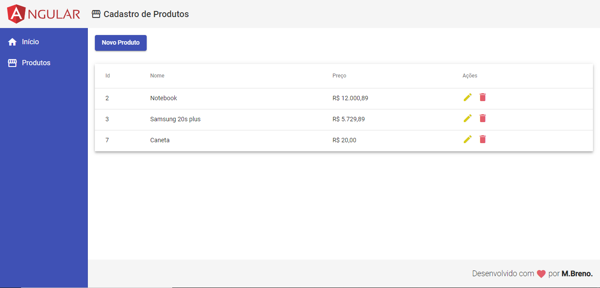

<h1 align="center">
  
</h1>

  <a href="#-tecnologias">Tecnologias</a>&nbsp;&nbsp;&nbsp;|&nbsp;&nbsp;&nbsp;
  <a href="#-projeto">Projeto</a>&nbsp;&nbsp;&nbsp;|&nbsp;&nbsp;&nbsp;
  <a href="#-como-executar">Como executar</a>&nbsp;&nbsp;&nbsp;|&nbsp;&nbsp;&nbsp;
  <a href="#-licença">Licença</a>

  

 

  

## 💻 CRUD - Angular

Estudo pratico, desenvolvido usado frameworl angular. 

Este projeto foi ministrado pelo [Leonardo Leitão](https://github.com/leonardomleitao 'Leonaro Leitão').

[cod3rcursos](https://github.com/cod3rcursos 'Cod3r cursos')

## ✨ Tecnologias

Esse projeto foi desenvolvido com as seguintes tecnologias:

- [Angular](https://angular.io/)
- [TypeScript](https://www.typescriptlang.org/)

## 💻 Projeto

O CRUD é um app desenvolvido com as 4 operações básicas (Create, Read, Update, Delete) utilizadas no banco de dados, nesse caso foi utilizando um arquivo .json para gravar as informações.

## 🚀 Como executar

- Clone o repositório
- Instale as dependências com `npm i`
- Navegue até o diretório backend
- Inicie o servidor backend `npm start`
- Navegue até o diretório frontend
- Inicie o servidor frontend `ng serve`

Agora você pode acessar [`localhost:4200`](http://localhost:4200) do seu navegador.

## 📄 Licença

Esse projeto está sob a licença MIT. Veja o arquivo [LICENSE](LICENSE.md) para mais detalhes.

Feito com ♥ by Márcio Breno 👋🏻

